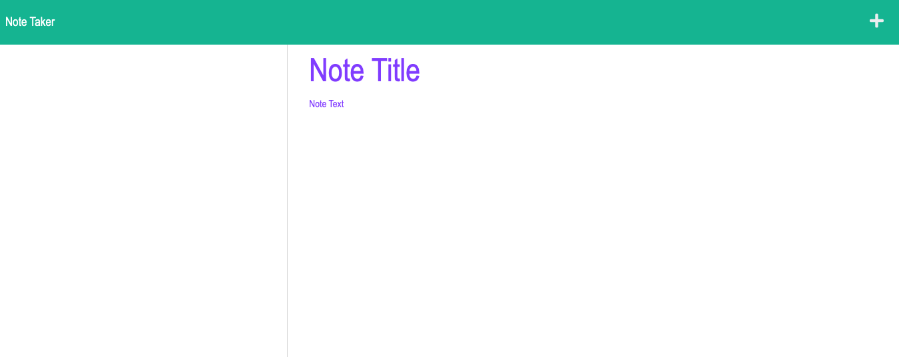

# Note-Taker

Express.js

-------------------------

## Description

An application that allows the user to write and save notes using an Express.js to fetch  data from a JSON file.

-------------------------

## Table of Contents

- [Technology Used](#technology-used)

- [Links](#links)

- [Screenshots](#screenshots)

- [Usage](#usage)

- [Credits](#credits)

- [Questions](#questions)

- [License](#license)

-------------------------

## Technology Used

- [Visual Studio Code](https://code.visualstudio.com/)
- [Node.js](https://nodejs.org/en/)
- [Express package](https://www.npmjs.com/package/express)
- [GitHub GUI](https://desktop.github.com/)
- [GitHub](https://www.github.com)
- [Heroku](https://www.heroku.com)

-------------------------

## Links

- [GitHub Repository](https://github.com/chunngaimo/noteTakerWithExpress)
- [Deployed Application]()

-------------------------

## Screenshots

-------------------------

## Usage

1. Load up the webpage.

2. Click the Get Started button.

3. Type in your note's title and text on the right-side of the screen.

4. Click the Save icon in the navigation bar in the top right of the screen.

-------------------------

## Credits

- Professor Google [Google](https://www.google.com/)

-------------------------

## Questions

Feel free to ask any questions and contact me at wjy16888888@gmail.com. 
GitHub repo link [Github](https://github.com/chunngaimo/noteTakerWithExpress)

-------------------------

## License

This project is licensed under the [MIT License](https://choosealicense.com/licenses/mit).

Copyright (c) 2021 Chun-Ngai Mo

Permission is hereby granted, free of charge, to any person obtaining a copy
of this software and associated documentation files (the "Software"), to deal
in the Software without restriction, including without limitation the rights
to use, copy, modify, merge, publish, distribute, sublicense, and/or sell
copies of the Software, and to permit persons to whom the Software is
furnished to do so, subject to the following conditions:

The above copyright notice and this permission notice shall be included in all
copies or substantial portions of the Software.

THE SOFTWARE IS PROVIDED "AS IS", WITHOUT WARRANTY OF ANY KIND, EXPRESS OR
IMPLIED, INCLUDING BUT NOT LIMITED TO THE WARRANTIES OF MERCHANTABILITY,
FITNESS FOR A PARTICULAR PURPOSE AND NONINFRINGEMENT. IN NO EVENT SHALL THE
AUTHORS OR COPYRIGHT HOLDERS BE LIABLE FOR ANY CLAIM, DAMAGES OR OTHER
LIABILITY, WHETHER IN AN ACTION OF CONTRACT, TORT OR OTHERWISE, ARISING FROM,
OUT OF OR IN CONNECTION WITH THE SOFTWARE OR THE USE OR OTHER DEALINGS IN THE
SOFTWARE.

-------------------------

